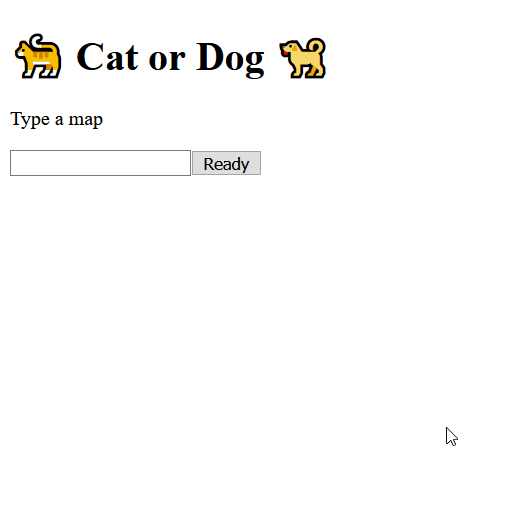

# 🐈 Cat or Dog 🐕

A simple game to test your memory.
The objective is simple. At a given score, is the correct answer a cat or a dog? There is a training mode where you can try to remember the sequence of cats or dogs, but you will get no help once you’re in playing mode.
The sequence is created based on the map name (seed) you provide. The sequence is therefore procedurally generated, meaning it will always be the same for a given map name.



# Running locally

Download and extract a zip of this project then run:
```
dotnet run
```
You also need the .Net Core runtime and Node installed already.

# License

This project is licensed under the MIT License - see the [LICENSE](LICENSE) file for details
